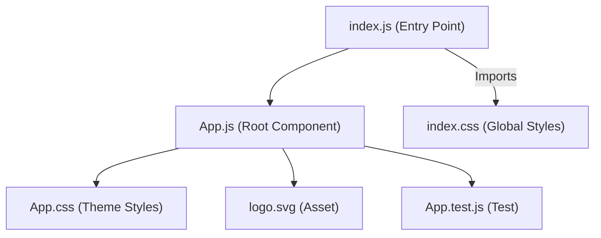

# Frontend Codebase Overview

## Introduction

This frontend project is a lightweight web application built with React, designed for high performance, maintainability, and ease of use. The architecture, styling, and tooling focus on simplicity and modern standards—with no heavy frameworks or unnecessary dependencies.

## Architecture and Structure

The project follows a standard React single-page application (SPA) architecture:
- **Entry Point:** The main entry for the application is `src/index.js`, which mounts the `App` component into the DOM root.
- **Main Application Component:** `src/App.js` contains all high-level logic for theme management, structure, and initial UI. It encapsulates the entire interface and delegates global behaviors.
- **Styling:** All styles are applied using vanilla CSS found in `src/App.css`. This file defines both light and dark theme color variables using CSS custom properties and implements responsive design principles.
- **Static Assets:** A React logo (`src/logo.svg`) is included as a central graphical element within the UI.
- **README:** The frontend project provides further usage, customization, and component details via its `README.md`.

### Component Model

This template is centered around a single application component, `App`, which:
- Manages application-wide *theme state* (light/dark mode) using React hooks.
- Exposes a UI button to toggle themes. The CSS applies the relevant theme variables to the root document element.
- Displays the application logo, descriptive instructional text, and a prominent link to the React documentation for developer onboarding.

### Theming

- **Light/Dark Mode:** The application supports both light and dark themes, dynamically switching CSS variables via the `data-theme` attribute at the document level (`App.js` with `App.css`). This provides maintainable theming without reliance on external libraries.
- **Responsive Design:** The CSS adjusts layout and input sizing for mobile screens, ensuring usability across a range of devices.

### Styling

- **Vanilla CSS:** There is no dependency on frameworks such as Bootstrap or Material-UI. The use of CSS modules or pre-processors is omitted in favor of simplicity and explicitness.
- **Branding and Customization:** Branding colors and UI component classes are customizable by modifying the root CSS variables in `App.css`. The documentation (README) provides explicit guidance on overriding these variables for rebranding or visual adjustments.

## Tooling and Technologies

- **React:** The backbone of the UI, leveraging React 18 features.
- **ReactDOM:** Used for DOM bindings and component mounting in `index.js`.
- **React Scripts:** The project is bootstrapped using Create React App (CRA), which provides standard build and development tooling.
- **ESLint:** Code quality is enforced via a custom ESLint configuration (`eslint.config.mjs`), including React plugin rules, modern ECMAScript syntax support, and selective global variable exposure for browser and testing environments.
- **Testing:** The setup includes a basic unit test for initial rendering (`App.test.js`), with support for Jest via `setupTests.js`.
- **Dependencies:** Only minimal dependencies are included for performance and clarity: `react`, `react-dom`, `react-scripts`. Developer tooling includes `cross-env` for consistent environment settings.

## Project Layout

```
frontend/
  ├── src/
  │   ├── App.js          # Main React component with theme logic
  │   ├── App.css         # Main stylesheet with theme and layout
  │   ├── index.js        # Entry point: renders App to DOM
  │   ├── logo.svg        # App logo asset
  │   ├── App.test.js     # Unit test for main component
  │   ├── index.css       # Global styles (font, layout resets)
  │   └── setupTests.js   # Jest configuration for test environment
  ├── package.json        # Dependencies and npm scripts
  ├── README.md           # Project documentation and customization
  └── eslint.config.mjs   # Linting configuration for code style/output
```

## Summary

This React-based frontend is intentionally minimalist and modern, providing only the necessary features and configuration for starting a robust, high-quality application. All UI and functionality can be extended by adding new React components, CSS modules, and business logic as required by the product. The clear separation of component, style, and test files aids in maintainability and team collaboration.

## Diagram: Application High-Level Architecture



---

> For further customization, consult the project README or extend the `App` component with additional features as your product evolves.

